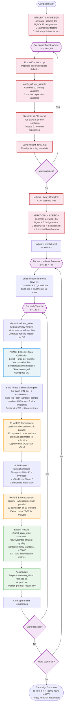

```mermaid
flowchart TD
    START(["Campaign Start"]) --> INF_LHS["INFLUENT LHS DESIGN
generate_influent_lhs
N_inf x 10 design matrix
5 Normal flow factors
5 Uniform pollutant factors"]

    INF_LHS --> INF_LOOP{{"For each influent sample
i = 1 to N_inf"}}
    INF_LOOP --> WIGM_INIT["Run WIGM init script
Populate base workspace defaults"]
    WIGM_INIT --> WIGM_OVERRIDE["apply_influent_sample
Override 10 primary variables
Compute dependent variables"]
    WIGM_OVERRIDE --> WIGM_SIM["Simulate WIGM model
728 days at 15-min resolution
Output: 21-column timeseries"]
    WIGM_SIM --> WIGM_SAVE["Save influent_NNN.mat
Checkpoint + log metadata"]
    WIGM_SAVE --> INF_CHECK{"More samples?"}
    INF_CHECK -- Yes --> INF_LOOP
    INF_CHECK -- No --> LIBRARY_DONE["Influent Library Complete
N_inf scenario files"]

    LIBRARY_DONE --> AER_LHS["AERATION LHS DESIGN
generate_aeration_lhs
N_aer x 5 design matrix
3 continuous + 2 categorical
+ 1 nominal baseline row"]
    AER_LHS --> POOL["Initialize parallel pool
W workers"]

    POOL --> SCEN_LOOP{{"For each Influent Scenario
s = 1 to N_inf"}}
    SCEN_LOOP --> LOAD_INF["Load influent library file
Save as DYNINFLUENT_ASM3.mat
Slice into T tranches of 30 days"]

    LOAD_INF --> TR_LOOP{{"For each Tranche
t = 1 to T"}}
    TR_LOOP --> DYN_WRITE["dynamicInfluent_writer
Extract 30-day window
Write tranche influent files
Compute tranche median for SS"]

    DYN_WRITE --> P1["PHASE 1: Steady-State Calibration
Serial -- once per tranche
benchmarkinit then benchmarkss then stateset
Save converged workspace W0"]

    P1 --> BUILD_P2["Build Phase 2 SimulationInputs
For each of N_aer+1 experiments:
build_kla_from_aeration_sample
resolves LHS row to 3 KLa timeseries
SimInput = W0 + KLa overrides"]

    BUILD_P2 --> PARSIM_P2["PHASE 2: Conditioning
parsim -- all experiments in parallel
30 days each on W workers
Biomass acclimates to cyclic KLa
Capture final ODE state xFinal"]

    PARSIM_P2 --> BUILD_P3["Build Phase 3 SimulationInputs
SimInput = W0 + KLa overrides
+ xFinal from Phase 2
Conditioned initial state"]

    BUILD_P3 --> PARSIM_P3["PHASE 3: Measurement
parsim -- all experiments in parallel
30 days each on W workers
Extract days 23-30 for analysis"]

    PARSIM_P3 --> EXTRACT["Extract Results
effluent_data_writer computes:
flow-weighted effluent quality
aeration energy via BSM1 + BSM2
SRT and limit violation metrics"]

    EXTRACT --> ACCUM["Accumulate
Prepend scenario_id and tranche_id
Append to master_parallel_results.csv"]

    ACCUM --> CLEANUP["Cleanup tranche temporaries"]
    CLEANUP --> TR_CHECK{"More tranches?"}
    TR_CHECK -- Yes --> TR_LOOP
    TR_CHECK -- No --> SCEN_CHECK{"More scenarios?"}
    SCEN_CHECK -- Yes --> SCEN_LOOP
    SCEN_CHECK -- No --> DONE

    DONE(["Campaign Complete
N_inf x T x N_aer+1 rows in CSV
Ready for GPR metamodel"])

    classDef generate fill:#fce4ec,stroke:#c62828,stroke-width:2px
    classDef phase fill:#e8f4f8,stroke:#2196F3,stroke-width:2px
    classDef parallel fill:#fff3e0,stroke:#FF9800,stroke-width:2px
    classDef data fill:#e8f5e9,stroke:#4CAF50,stroke-width:2px
    classDef loop fill:#f3e5f5,stroke:#9C27B0,stroke-width:2px

    class INF_LHS,WIGM_INIT,WIGM_OVERRIDE,WIGM_SIM,WIGM_SAVE,LIBRARY_DONE generate
    class AER_LHS generate
    class P1 phase
    class PARSIM_P2,PARSIM_P3 parallel
    class EXTRACT,ACCUM data
    class SCEN_LOOP,TR_LOOP,TR_CHECK,SCEN_CHECK,INF_LOOP,INF_CHECK loop
```